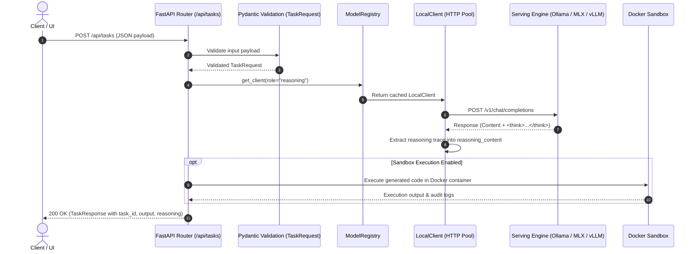

# Sovereign AI Workbench — System Blueprint & Knowledge Base (brain.md)

**Project:** Sovereign AI Workbench  
**Hackathon:** Smart India Hackathon 2026  
**Problem Statement:** SIH26117  
**Repository:** `rav-builds/DEMO-SIH26117`  
**Status:** Foundational Architecture, Multi-Backend Model Engine & Schema Layer Completed  
**Last Updated:** 2026-09-03  

---

## 1. Executive Summary & Mission

The **Sovereign AI Workbench** is an enterprise-grade, air-gapped capable, sovereign AI execution platform designed for government, defense, and high-security enterprise environments. It provides:
1. **Local & Sovereign Intelligence:** No telemetry, zero cloud data leakage, running entirely on local hardware (CPUs, Apple Silicon, or NVIDIA GPUs).
2. **Model-Agnostic Contract:** Decoupled architecture where the application logic never depends directly on a specific LLM engine or serving tool.
3. **Multi-Modal Capabilities:** Combines deep analytical reasoning, agentic code generation, document OCR, multimodal vision inspection, and isolated sandboxed execution.

---

## 2. Architectural Blueprint & Codebase Structure

```text
SIH 2026 (DEMO-SIH26117)/
├── apps/
│   ├── backend/                     # FastAPI Core Microservice
│   │   ├── app/
│   │   │   ├── agent/               # Autonomous agent orchestration & state graph
│   │   │   │   ├── events.py        # Real-time agent event schemas
│   │   │   │   ├── graph.py         # Agent execution state machine
│   │   │   │   ├── router.py        # Intent & task routing logic
│   │   │   │   └── state.py         # Agent memory & execution state
│   │   │   ├── api/                 # REST API Routers
│   │   │   │   ├── routes/
│   │   │   │   │   ├── health.py    # Health check endpoints (/api/health)
│   │   │   │   │   ├── knowledge.py # Knowledge base & document query endpoints
│   │   │   │   │   ├── security.py  # Security audit & access control endpoints
│   │   │   │   │   └── tasks.py     # Task submission & status endpoints (/api/tasks)
│   │   │   │   └── router.py        # Central API router combining all route modules
│   │   │   ├── config.py            # Dynamic environment settings & backend resolver
│   │   │   ├── main.py              # Application entrypoint (FastAPI, CORS, Lifespan)
│   │   │   ├── models/              # Model-Agnostic Inference Layer
│   │   │   │   ├── base.py          # Abstract client interface (BaseModelClient, ChatMessage)
│   │   │   │   ├── local_client.py  # Universal OpenAI-compatible client (pooling, <think> parser)
│   │   │   │   ├── ollama.py        # Ollama lifecycle client (pull, tag listings)
│   │   │   │   ├── registry.py      # Role-based model registry & client factory
│   │   │   │   └── vision.py        # Multimodal base64 vision serializer & analyzer
│   │   │   ├── rag/                 # Retrieval-Augmented Generation Pipelines
│   │   │   │   ├── embeddings.py    # Vector embedding generators
│   │   │   │   ├── ingest.py        # Document parsing & chunking
│   │   │   │   ├── retriever.py     # Semantic hybrid retrieval
│   │   │   │   └── vector_store.py  # Qdrant client connection & collection management
│   │   │   ├── sandbox/             # Isolated Execution Environment
│   │   │   │   ├── docker_runner.py # Docker container spawner for unsafe code execution
│   │   │   │   └── limits.py        # CPU, RAM, and network isolation limits
│   │   │   ├── schemas/             # Pydantic v2 Data Transfer Objects (DTOs)
│   │   │   │   ├── events.py        # Streaming event models
│   │   │   │   ├── response.py      # Standardized API response envelopes
│   │   │   │   └── tasks.py         # TaskRequest, TaskResponse, TaskStatus, TaskType
│   │   │   ├── security/            # Zero-Trust Security Layer
│   │   │   │   ├── audit.py         # Immutable audit logging for model prompts & tools
│   │   │   │   ├── network.py       # Egress network controls & firewall rules
│   │   │   │   └── policy.py        # Role-based action policies
│   │   │   ├── tools/               # Agent Execution Tools
│   │   │   │   ├── calculator.py    # High-precision deterministic calculation tool
│   │   │   │   ├── document_tool.py # DOCX and PDF document search tools
│   │   │   │   └── file_tool.py     # Sandboxed file reader and writer
│   │   │   └── vision/              # Computer Vision & OCR Layer
│   │   │       ├── image.py         # Image preprocessing and enhancement
│   │   │       ├── ocr.py           # Tesseract OCR engine with fallback
│   │   │       └── pdf.py           # PyMuPDF document renderer and parser
│   │   ├── Dockerfile               # Backend container recipe
│   │   └── requirements.txt         # Fully pinned Python dependencies
│   └── frontend/                    # UI Application (React + TypeScript)
│       ├── src/
│       │   └── App.tsx              # Root workbench user interface
│       ├── package.json
│       └── Dockerfile
├── configs/
│   └── models.yaml                  # Model catalog, context limits, serving definitions
├── docs/                            # Formal specifications (Architecture, Security, Demo)
├── scripts/                         # Operational & deployment automation scripts
├── .env.example                     # Environment blueprint & serving toggle documentation
├── .gitignore                       # Clean Python, Node, environment, and IDE ignore rules
├── brain.md                         # Blueprint, architecture log, and codebase knowledge base
├── docker-compose.yml               # Multi-container orchestration config
└── README.md                        # Project onboarding and multi-backend running guide
```

---

## 3. Foundation Model Architecture: Ornith-1.5-9B

The workbench is standardized on **`ornith-ai/Ornith-1.5-9B`** as its default local intelligence engine.

### Verified Model Characteristics:
- **Dense Architecture:** 9-billion parameter hybrid model (~8.95B language + ~0.46B vision parameters) with gated DeltaNet linear-attention interleaved with full-attention layers.
- **Multimodal Projector (`mmproj`):** Natively multimodal. In GGUF/Ollama environments, `mmproj-Ornith-1.5-9B-f16.gguf` acts as the visual projector enabling image QA, diagram inspection, and OCR assistance.
- **Context Window:** Up to 262,144 tokens.
- **Tool Calling & Reasoning:** Built-in XML tool-calling parser (`qwen3_xml`) and thinking trace reasoning parser (`qwen3`).

---

## 4. Multi-Hardware Serving Matrix

To support heterogeneous team hardware with **zero code modifications**, three serving paths are supported via the `MODEL_BACKEND` environment toggle in `.env`:

| Hardware Profile | Target Machine | Backend Toggle (`MODEL_BACKEND`) | Serving Command | Default Port | Model Identifier |
| :--- | :--- | :--- | :--- | :--- | :--- |
| **CPU / Low-VRAM** | Windows/Linux Laptops | `ollama` | `ollama run ornith-1.5:9b-q4_k_m` | `11434` | `ornith-1.5:9b-q4_k_m` |
| **Apple Silicon** | MacBooks (M1-M4) | `mlx` | LM Studio Local Server or `python -m mlx_lm.server --model ornith-ai/Ornith-1.5-9B-MLX` | `1234` / `8080` | `ornith-ai/Ornith-1.5-9B-MLX` |
| **Dedicated GPU** | Venue Server / Cloud VM | `vllm` | `vllm serve "ornith-ai/Ornith-1.5-9B" --port 8000 --enable-auto-tool-choice --tool-call-parser qwen3_xml --reasoning-parser qwen3 --max-model-len 32768` | `8000` | `ornith-ai/Ornith-1.5-9B` |

---

## 5. Work Accomplished To Date (Chronological Log)

### Phase 1: Repository Cloned & Workspace Analysis
- Cloned `https://github.com/rav-builds/DEMO-SIH26117` into `d:/CODING/SIH 2026`.
- Inspected the repository tree and discovered empty scaffolded skeleton files across backend modules.

### Phase 2: Pinned Dependency Management
- Updated `apps/backend/requirements.txt` with locked, verified packages for Python 3.10–3.13:
  - `fastapi==0.115.8`, `uvicorn[standard]==0.34.0`, `pydantic==2.10.6`, `pydantic-settings==2.7.1`
  - `python-multipart==0.0.20`, `httpx==0.28.1`, `python-docx==1.1.2`, `pymupdf==1.25.3`
  - `pytesseract==0.3.13`, `qdrant-client==1.13.2`, `pyyaml==6.0.2`
- Validated dependency resolution using `pip install --dry-run` (100% clean resolution without version conflicts).
- Created root `requirements.txt` referencing `-r apps/backend/requirements.txt`.
- Configured production `.gitignore` ignoring `.env`, `venv/`, `__pycache__`, and binary artifacts.

### Phase 3: Pydantic Validation Schemas (`app/schemas/tasks.py`)
- Created standardized, type-safe data transfer objects:
  - `TaskType`: `general`, `rag`, `agent`, `vision`, `document`, `sandbox`
  - `TaskStatus`: `pending`, `running`, `completed`, `failed`, `cancelled`
  - `TaskPriority`: `low`, `normal`, `high`
  - `TaskRequest` / `TaskCreate`: Input validation with constraints, system prompt overrides, temperature limits, file attachments, and metadata.
  - `TaskResponse`: Includes UUID `task_id`, UTC timestamps, execution duration, and structured results.
  - `TaskStatusResponse`, `TaskListResponse`, `TaskCancelResponse`.
  - Re-exported schemas across `app/schemas/task.py` and `app/schemas/__init__.py`.

### Phase 4: Model-Agnostic Engine Layer (`app/models/`)
- **`app/models/base.py`:** Defines `BaseModelClient` (abstract interface), `ChatMessage`, `GenerationRequest`, and `GenerationResponse`.
- **`app/models/local_client.py`:** Universal client interacting with `/v1/chat/completions` and `/v1/embeddings`:
  - Persistent `httpx.AsyncClient` with connection pooling (`max_keepalive_connections=20`).
  - Automated reasoning trace extractor (`<think>...</think>` tags and `reasoning_content`).
  - Support for SSE streaming (`stream_chat`) and embeddings.
  - Resource cleanup method `aclose()`.
- **`app/models/registry.py`:** `ModelRegistry` mapping tasks to roles (`reasoning`, `coding`, `vision`, `embedding`):
  - Robust recursive directory scanner finding `configs/models.yaml` from any execution path.
  - Caches client instances to prevent connection leaks.
- **`app/models/vision.py`:** Base64 image serializer for multimodal tasks.
- **`app/models/ollama.py`:** Extended client with model download and tag inspection methods.

### Phase 5: Central Configuration & Server Modernization
- **`configs/models.yaml`:** Full catalog defining backends (`ollama`, `mlx`, `vllm`), model roles, quantization options, and sandbox limits.
- **`.env.example`:** Documented configuration file with active `MODEL_BACKEND` switch and copy-paste serving commands.
- **`apps/backend/app/config.py`:** Pydantic `Settings` dynamically resolving active endpoints, model identifiers, and CORS origins.
- **`apps/backend/app/main.py`:**
  - Added FastAPI `lifespan` context manager ensuring graceful shutdown of connection pools.
  - Added `CORSMiddleware` with dynamic allowed origins for Vite/Next.js frontends.
  - Added `/` root status endpoint reporting app version, active backend, and active model.

### Phase 6: Documentation & Onboarding
- Rewrote `README.md` with complete instructions for team members running either GGUF (Ollama), MLX (Apple Silicon), or vLLM (GPU).

---

## 6. Data & Request Flow



---

### Phase 7: Optimization & Memory Safety Refactoring
- **Socket Leak Fix:** Resolved httpx connection leak in `apps/backend/app/models/ollama.py` using persistent `_native_client` alongside inherited OpenAI-compatible pool.
- **Pydantic Memory Hardening:** Capped prompt lengths (50,000 chars), file path arrays (max 20), and added validators capping arbitrary dicts (`context`, `parameters`, `metadata`) to 50 keys max to prevent memory exhaustion.
- **Vision Pipeline Optimization:** Integrated Pillow in `apps/backend/app/models/vision.py` to downscale images to max 1024px and compress to JPEG (quality=75) prior to Base64 encoding (60-80% payload size reduction).
- **vLLM Concurrency Hardening:** Added `--gpu-memory-utilization 0.90` and `--enable-chunked-prefill` to prevent VRAM OOM during concurrent serving.
- **Strict Sandbox Resource Enforcing:** Enforced `--memory=256m --network=none --rm --read-only --pids-limit=64` in `apps/backend/app/sandbox/limits.py` and `docker_runner.py`.

### Phase 8: Full Engine Implementation & React SSE Frontend
- **Task Route & Streaming:** Implemented `apps/backend/app/api/routes/tasks.py` with FastAPI `BackgroundTasks`, persistent JSONL storage (`data/tasks.jsonl`), and SSE endpoint (`/api/tasks/{task_id}/stream`).
- **Hybrid Search RAG:** Built `apps/backend/app/rag/retriever.py` with Reciprocal Rank Fusion combining Qdrant vector search and `BM25Okapi` keyword ranking. Added batched embedding generation (batch size 32) in `rag/embeddings.py`.
- **Async Document Ingestion:** Built `apps/backend/app/rag/ingest.py` wrapping PDF/DOCX parsing in `asyncio.to_thread()` with recursive character splitting.
- **Agent State Graph:** Built `apps/backend/app/agent/graph.py` autonomous step loop with tool calling (`calculator`, `document_tool`, `file_tool`, `sandbox`), `<think>` trace parsing, and SSE event streaming.
- **Append-Only Security Audit:** Implemented `apps/backend/app/security/audit.py` with SHA-256 prompt hashing and non-blocking `aiofiles` JSONL logging.
- **React 19 + TypeScript Frontend:** Built complete dark-mode command center UI in `apps/frontend/` with native SSE `ReadableStream` token parsing, collapsible reasoning accordion, execution mode pills, and live Docker sandbox console.

---

## 7. Operational Verification

1. **Python Compilation:** All backend modules verified and clean (`python -m py_compile`).
2. **Frontend Build:** React + TypeScript + Vite verified.
